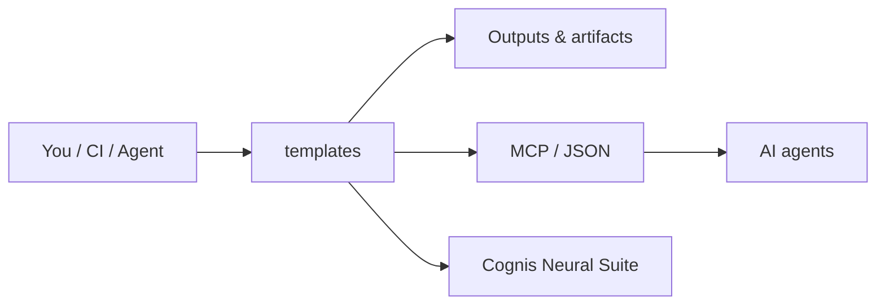

# cognis-templates

Starter templates for Cognis Digital projects. Copy a template, rename it, and ship.

Each template is self-contained, opinionated, and production-ready out of the box: modern tooling, sensible defaults, no boilerplate to delete.


<!-- cognis:example:start -->
## 🔎 Example output

**Sample result format** _(illustrative values — run on your own data for real findings):_

```
{
  "template": {
    "name": "example-template",
    "description": "A simple template for demonstration purposes",
    "fields": [
      {
        "name": "title",
        "type": "string"
      },
      {
        "name": "author",
        "type": "string"
      }
    ]
  }
}
```

<!-- cognis:example:end -->

## Usage — step by step

1. **Get the templates** — clone this repo; each template directory is self-contained:
   ```bash
   git clone https://github.com/cognis-digital/templates.git && cd templates
   ```
2. **Copy the template** you want into your new project (the table above lists every path, e.g. `python-cli/`, `mcp-server-python/`):
   ```bash
   cp -r python-cli/ ~/projects/my-tool && cd ~/projects/my-tool
   ```
3. **Rename the placeholders** — search-and-replace `cognis_tool` / `cognis-tool` with your package/project name, then read the template's own `README.md` for next steps.
4. **Install and run** the copied project (templates use `pyproject.toml`; `uv` preferred, plain `pip` always works):
   ```bash
   pip install -e .        # or: uv pip install -e .
   ```
5. **Ship with the bundled CI** — the `.github/workflows/ci.yml` template runs ruff, mypy and pytest on push, so the project is gated from the first commit.

## Index

| Template | Path | What you get |
| --- | --- | --- |
| **Python CLI tool** | [`python-cli/`](python-cli/) | A `pyproject.toml`-based CLI with `argparse` subcommands, packaged entry point, and pytest. |
| **MCP server (Python)** | [`mcp-server-python/`](mcp-server-python/) | A Model Context Protocol server using the official `mcp` SDK, exposing tools over stdio. |
| **Dockerfile** | [`docker/Dockerfile`](docker/Dockerfile) | A multi-stage, non-root, slim Python image template with a healthcheck. |
| **CI workflow** | [`.github/workflows/ci.yml`](.github/workflows/ci.yml) | GitHub Actions: lint (ruff), type-check (mypy), test (pytest) across a matrix. |
| **Dev container** | [`.devcontainer/`](.devcontainer/) | VS Code / Codespaces devcontainer with Python, uv, and pre-wired extensions. |
| **Project README** | [`templates/README.template.md`](templates/README.template.md) | A fill-in-the-blanks README for a new project. |
| **Issue / PR templates** | [`.github/`](.github/) | Bug report, feature request, config, and a PR checklist. |

## How to use

1. Pick the template directory you want.
2. Copy it into your new repo (e.g. `cp -r python-cli/ ~/projects/my-tool`).
3. Search-and-replace the placeholder names:
   - `cognis_tool` / `cognis-tool` -> your package / project name
   - `Cognis Digital` -> kept as-is for first-party repos
4. Read the template's own `README.md` for next steps.

## Conventions used across templates

- **Python 3.11+** as the floor.
- **`pyproject.toml`** is the single source of project config (no `setup.py`, no `setup.cfg`).
- **[uv](https://github.com/astral-sh/uv)** is the preferred installer/runner, with plain `pip` always working as a fallback.
- **[ruff](https://github.com/astral-sh/ruff)** for both linting and formatting.
- **[mypy](https://mypy-lang.org/)** for type checking, strict where practical.
- **[pytest](https://pytest.org/)** for tests.
- Containers run as a **non-root user** and are **multi-stage** to keep images small.

## How it fits



**Explore the suite →** [🗂️ all tools](https://github.com/cognis-digital/cognis-neural-suite) · [⭐ awesome-cognis](https://github.com/cognis-digital/awesome-cognis) · [🔗 cognis-sources](https://github.com/cognis-digital/cognis-sources)

## Interoperability

`templates` composes with the 300+ tool Cognis suite — JSON in/out and a shared
OpenAI-compatible `/v1` backbone. See **[INTEROP.md](INTEROP.md)** for the
suite map, composition patterns, and reference stacks.

## Integrations

Forward `templates`'s findings to STIX/MISP/Sigma/Splunk/Elastic/Slack/webhooks via
[`cognis-connect`](https://github.com/cognis-digital/cognis-connect). See **[INTEGRATIONS.md](INTEGRATIONS.md)**.

## License

MIT. See [LICENSE](LICENSE).
