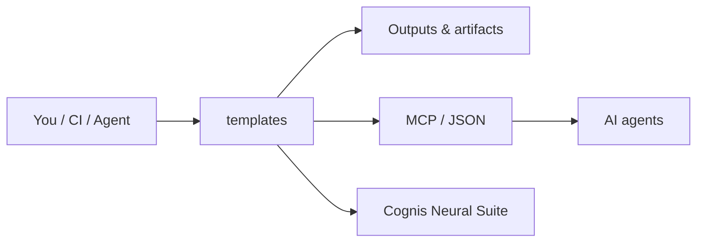

# cognis-templates

Starter templates for Cognis Digital projects. Copy a template, rename it, and ship.

Each template is self-contained, opinionated, and production-ready out of the box: modern tooling, sensible defaults, no boilerplate to delete.

<!-- cognis:layman:start -->
## What is this?

This repository is a collection of ready-to-use starting points for building software tools. Instead of spending hours setting up a new project from scratch, you pick a template — like a Python command-line tool or an AI server — copy it, and start writing your actual code right away. Each template already includes testing, linting, and packaging set up the same way across all Cognis Digital projects. It is meant for developers who want a consistent, modern foundation without repeating the same boilerplate every time.
<!-- cognis:layman:end -->

## Getting started

1. Clone this repository:
   ```sh
   git clone https://github.com/cognis-digital/templates.git
   cd templates
   ```
2. Browse the template directories listed in the [Index](#index) below.
3. Copy the template you want into your new project folder:
   ```sh
   cp -r python-cli/ ~/projects/my-new-tool
   ```
4. Replace placeholder names (`cognis_tool`, `cognis-tool`) with your project name.
5. Follow the `README.md` inside the copied template for next steps.

To run the included tests (requires Python 3.11+):
```sh
python -m pytest -q
```

## Index

| Template | Path | What you get |
| --- | --- | --- |
| **Python CLI tool** | [`python-cli/`](python-cli/) | A `pyproject.toml`-based CLI with `argparse` subcommands, packaged entry point, and pytest. |
| **MCP server (Python)** | [`mcp-server-python/`](mcp-server-python/) | A Model Context Protocol server using the official `mcp` SDK, exposing tools over stdio. |
| **Dockerfile** | [`docker/Dockerfile`](docker/Dockerfile) | A multi-stage, non-root, slim Python image template with a healthcheck. |
| **CI workflow** | [`.github/workflows/ci.yml`](.github/workflows/ci.yml) | GitHub Actions: lint (ruff), type-check (mypy), test (pytest) across a matrix. |
| **Dev container** | [`.devcontainer/`](.devcontainer/) | VS Code / Codespaces devcontainer with Python, uv, and pre-wired extensions. |
| **Project README** | [`templates/README.template.md`](templates/README.template.md) | A fill-in-the-blanks README for a new project. |
| **Issue / PR templates** | [`.github/`](.github/) | Bug report, feature request, config, and a PR checklist. |

## How to use

1. Pick the template directory you want.
2. Copy it into your new repo (e.g. `cp -r python-cli/ ~/projects/my-tool`).
3. Search-and-replace the placeholder names:
   - `cognis_tool` / `cognis-tool` -> your package / project name
   - `Cognis Digital` -> kept as-is for first-party repos
4. Read the template's own `README.md` for next steps.

## Conventions used across templates

- **Python 3.11+** as the floor.
- **`pyproject.toml`** is the single source of project config (no `setup.py`, no `setup.cfg`).
- **[uv](https://github.com/astral-sh/uv)** is the preferred installer/runner, with plain `pip` always working as a fallback.
- **[ruff](https://github.com/astral-sh/ruff)** for both linting and formatting.
- **[mypy](https://mypy-lang.org/)** for type checking, strict where practical.
- **[pytest](https://pytest.org/)** for tests.
- Containers run as a **non-root user** and are **multi-stage** to keep images small.

## How it fits



**Explore the suite →** [🗂️ all tools](https://github.com/cognis-digital/cognis-neural-suite) · [⭐ awesome-cognis](https://github.com/cognis-digital/awesome-cognis) · [🔗 cognis-sources](https://github.com/cognis-digital/cognis-sources)

## License

MIT. See [LICENSE](LICENSE).
